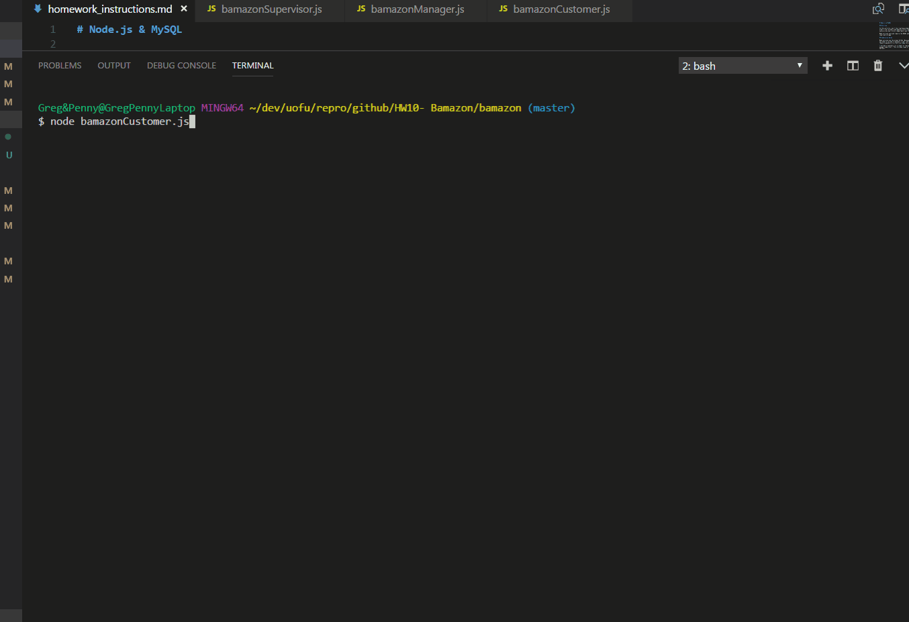
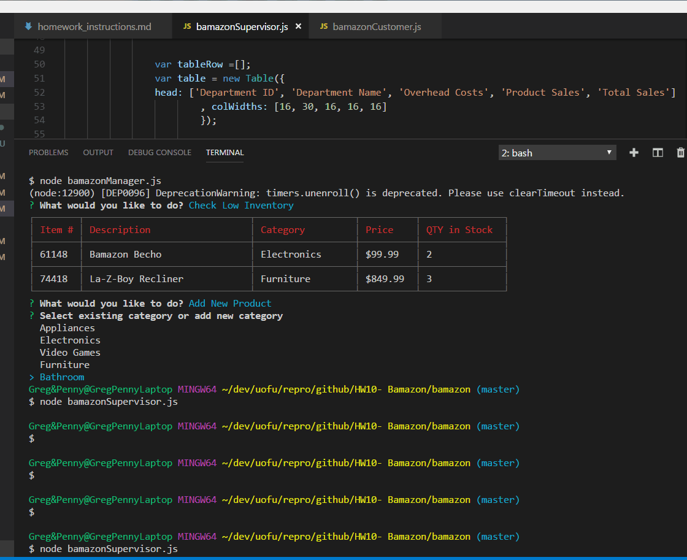

# Bamazon
-----------------------------------------------------------------------------------------------------------
### Welcome to bamazon.  This node.js project uses mySQL to simulate a shopping web site.  There are 3 different node files to run.  The customer file simply lets you view available items to purchase, and allows you to buy a certain quantity of items.  It pulls the items from the database, and checks the quantity to make sure there's enough in stock. Here it is in action:

### The second node file lets a manager check the products, including how much stock is in inventory.  He/she can also pull up a list of items which have a stock amount of 5 or less.  They can then add stock to any item.  Finally, they are able to pull up a list of departments puopulated from a separate table, and add a product to that department. Here it is: 

### The final node file lets a supervisor check all departments, pulling information from both tables, to see total sales, total overhead, and total profit.  They can also add a new department if needed. And finally:

